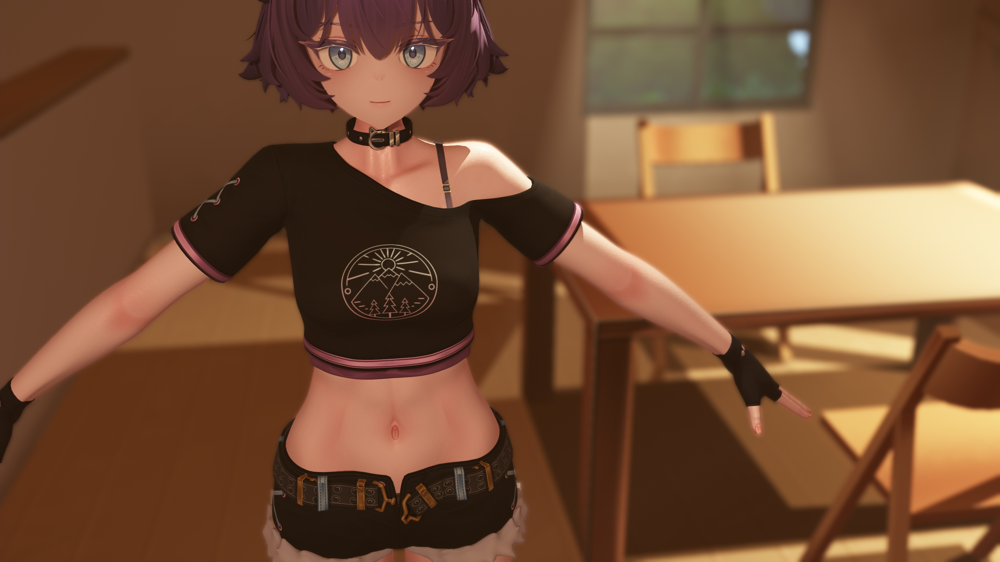
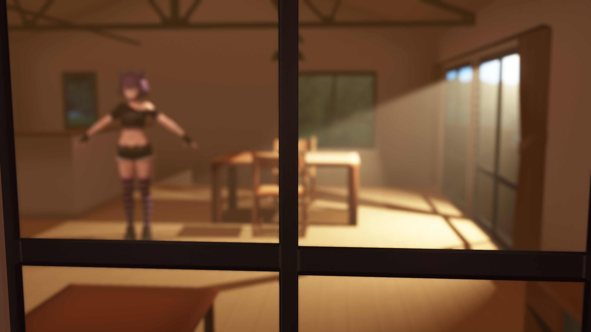
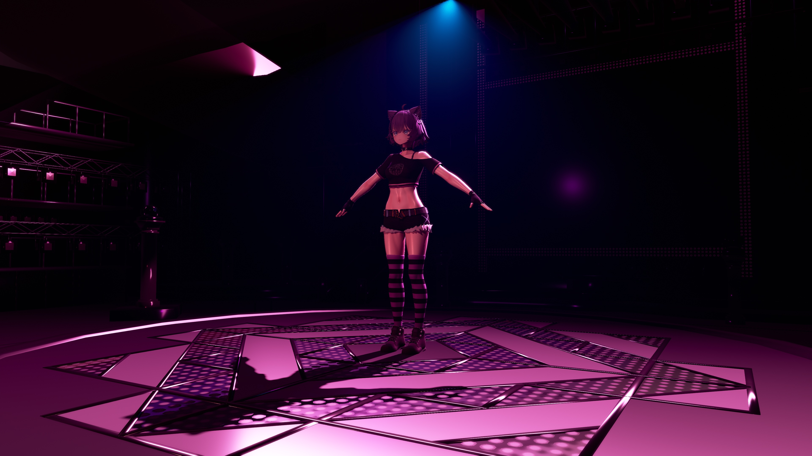

# Ray-MMD Lighting Samples (2 Types)
This is a sample lighting setup for ray-mmd. Two different lighting presets are prepared on frame 0 and frame 1.

## Required Files

### https://www.quappael.com/
- ① 伏祓 七々春(ｶｼﾞｭｱﾙﾊﾟﾝｸ)/ EL-Pr243M1(FUKUHARAE)_v1_0_2
- ② モダンハウス ver A.0.2

### https://github.com/ray-cast/ray-mmd
- ray-mmd-1.5.2
- ray-mmd-master (download directly from the master branch)

## Installation

1. Overwrite the `UserFile` folder into `MikuMikuDance_v932x64\UserFile`
2. Place the downloaded `ray-mmd-1.5.2` into `UserFile/_presets/oo0/effect`
3. Overwrite the `Lighting` folder from the downloaded `ray-mmd-master` into the placed `ray-mmd-1.5.2`
4. Overwrite the contents of `(Override files)` into the placed `ray-mmd-1.5.2`
5. Place models ① and ② into `UserFile/_presets/oo0/model`

## Required Model Modifications

- For model ①, reset the normals of the hair materials  
  (Edit > Normal > Average Normals - Face)
- For model ②, enable 2-SIDE for all materials

When using this setup, please turn **off anti-aliasing in MMD**.

## History

2025/12/20 oo0 v1.0  
2025/12/19 oo0 Test Release

## Preview

